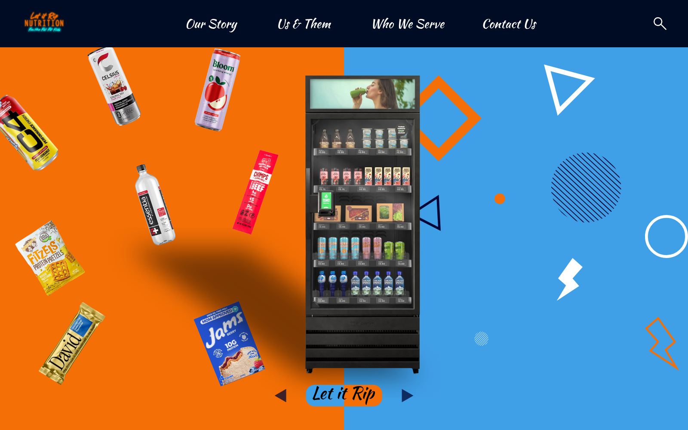
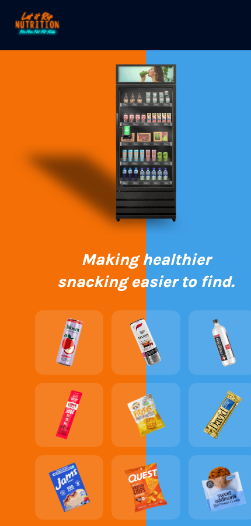

# Let It Rip Nutrition

A fully responsive marketing website for Let It Rip Nutrition, a company that places healthy-snack vending machines in gyms, offices, hotels, and other locations. Built from a Figma design into production HTML/CSS/JS and deployed live.

**Live site:** [letitripnutrition.com](https://letitripnutrition.com)





## Overview

The site covers the full marketing funnel for the business:

- **Home** — animated product showcase and vending machine hero
- **Our Story** — founder bio and brand mission
- **Us & Them** — swipeable product comparison cards (Let It Rip vs. typical snack brands) plus a head-to-head vending machine comparison
- **Who We Serve** — icon grid of target venue types, plus a "Why Partner With Us" breakdown
- **Contact** — lead-capture form wired to email delivery

## Features

- Hand-built responsive layouts for every page — separate, purpose-designed mobile layouts rather than naive scaling of the desktop design (notably the homepage hero and the Us & Them comparison sections)
- Custom JS-driven swipeable card carousel for product comparisons
- Mobile hamburger navigation
- Contact form integrated with [Formspree](https://formspree.io) for serverless email delivery
- Image assets optimized/resized per use case to keep page weight down
- No build step or framework — plain HTML, CSS, and vanilla JS throughout

## Tech Stack

- HTML5 / CSS3 (custom, no framework)
- Vanilla JavaScript
- [Formspree](https://formspree.io) for form-to-email delivery
- Deployed on [Cloudflare Workers](https://developers.cloudflare.com/workers/static-assets/) (static assets) with a custom domain

## Local Development

This is a static site with no build step. Clone the repo and serve it with any static file server, for example:

```bash
npx serve .
```

or use the VS Code "Live Server" extension.

## Deployment

Pushes to `main` auto-deploy via Cloudflare Workers' Git integration. The `wrangler.toml` and `.assetsignore` files configure the repo to deploy as a static-assets Worker.
